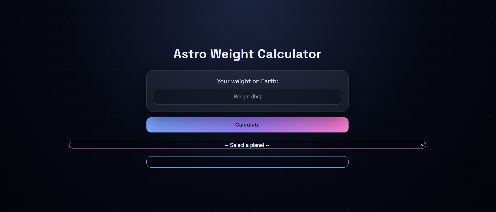
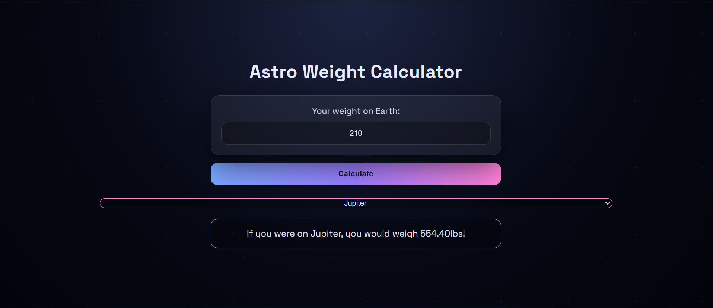

# Astro Weight Calculator

A client-side web application that calculates your weight on different planets using relative gravitational values. Built as part of the CCC Web 102 curriculum, this project demonstrates core front-end skills using vanilla web technologies.

---

## Features

* Calculate your weight across multiple planets
* Uses real relative gravity values
* Clean, responsive UI
* Instant results with client-side JavaScript
* No backend or database required

---

## Tech Stack

* HTML5 – structure and layout
* CSS3 – styling and layout
* JavaScript (ES6) – calculation logic and interactivity
* Node / npm – project setup and tooling

---

## Screenshots

### Main Calculator Interface



### Example Calculation Output



---

## Installation & Usage

1. Clone the repository:

   ```bash
   git clone git@github.com:awaddell-dev/Astro-Weight-Calculator.git
   ```

2. Navigate into the project folder:

   ```bash
   cd Astro-Weight-Calculator
   ```

3. Install dependencies (if required):

   ```bash
   npm install
   ```

4. Open `index.html` in your browser or run a local server.

---

## What I Learned

* DOM manipulation with JavaScript
* Handling user input and validation
* Applying real-world data (gravity ratios) in calculations
* Structuring a small front-end project
* Using Git and GitHub for version control

---

## Future Improvements

* Add more celestial bodies
* Improve mobile responsiveness
* Add unit tests
* Deploy live using GitHub Pages

---

## Author

Alex Waddell
GitHub: [https://github.com/awaddell-dev](https://github.com/awaddell-dev)

---

If you found this project useful or interesting, feel free to star the repository.